# Appearance-Aware LOD for HashDAG

This repository extends the HashDAG voxel renderer with screen-space level of detail (LOD), multi-resolution colour lookup, node-local directional relief, roughness modulation, and coverage-aware refinement. The objective is to avoid resolving sub-pixel voxel geometry while retaining more of its silhouette and shading behaviour than a coarse box-normal approximation.

The complete method, experiments, and discussion are available in the [project report](Report.pdf).

The project is a research fork of the implementation accompanying [Interactively Modifying Compressed Sparse Voxel Representations](https://graphics.tudelft.nl/Publications-new/2020/CBE20/ModifyingCompressedVoxels-main.pdf) by Careil, Billeter, and Eisemann. The original [video](https://youtu.be/GQAwDn1bh0E) and [talk](https://youtu.be/ltkk_nlMhQo?t=254) remain useful introductions to HashDAG editing.

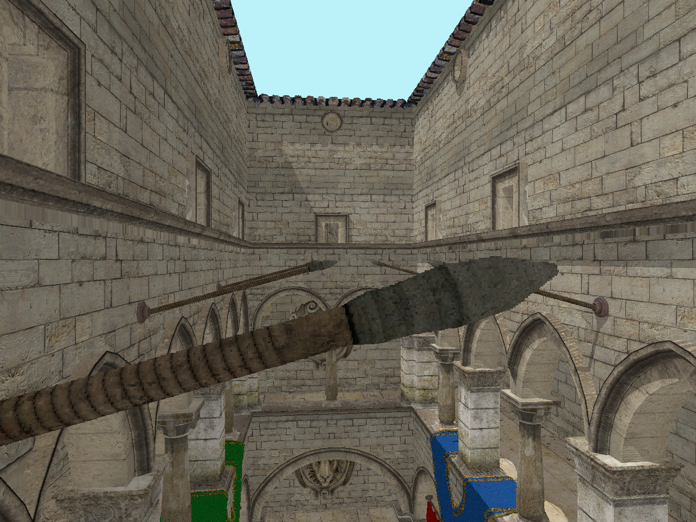

## What this fork adds

- A projected-size termination rule integrated into the existing DAG ray traversal.
- Representative colour retrieval at the accepted geometry level.
- A bottom-up prefilter containing six node-local internal-relief values.
- Three coverage-derived passability bits that allow sparse nodes to descend by up to five additional levels.
- View-dependent relief shading and GGX roughness modulation from directional variance.
- One inline 32-bit descriptor per stored geometry node, excluded from structural hashing and equality.
- Runtime, image-quality, construction-time, and memory evaluation tools.

## Representation background

An SVO removes empty regions from a dense voxel grid. An SVDAG additionally merges identical leaves and subtrees, allowing multiple parents to reference the same geometry.

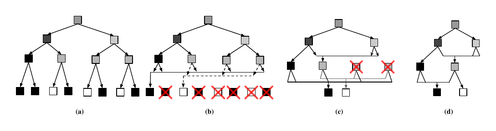

*SVO-to-SVDAG reduction reproduced from Kämpe, Sintorn, and Assarsson, "High Resolution Sparse Voxel DAGs", 2013.*

HashDAG uses hash-based node reuse to preserve this sharing while reconstructing only the paths affected by an edit.

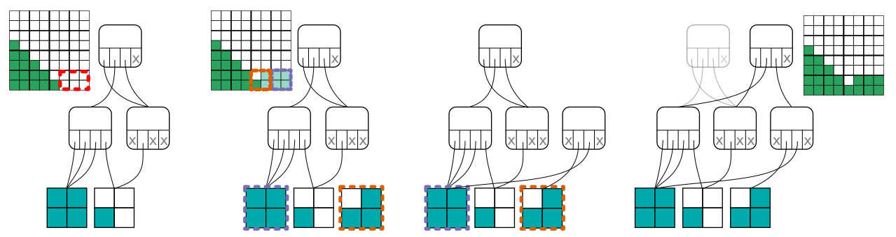

*HashDAG editing reproduced from Careil, Billeter, and Eisemann, "Interactively Modifying Compressed Sparse Voxel Representations", 2020.*

## Method

The complete pipeline first constructs geometry, colour, and a node-local prefilter for each unique DAG node. At runtime, screen-space LOD selects a candidate node, coverage may request bounded additional descent, and the accepted node supplies representative colour and prefiltered shading data.

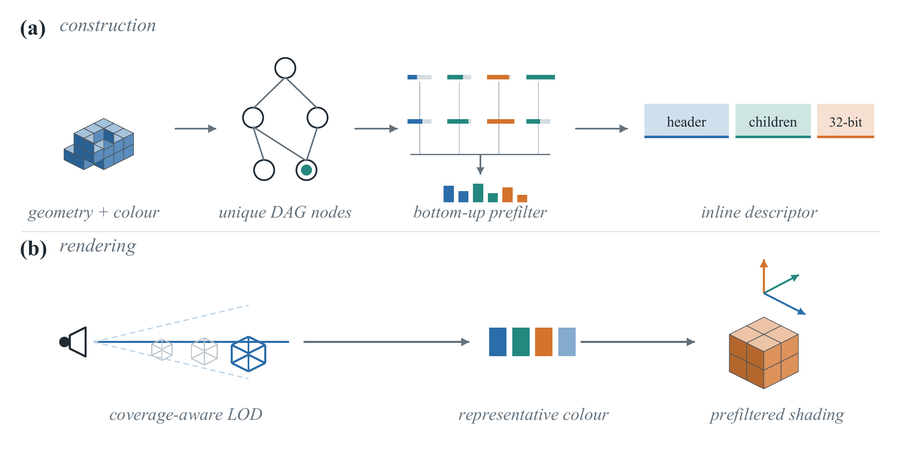

### Screen-space LOD

The projected node size is estimated from its edge length, camera distance, and pixel angular footprint. Traversal may terminate once the node becomes sufficiently small on screen. Setting <code>LOD_PIXEL_THRESHOLD</code> to zero retains full-resolution traversal.

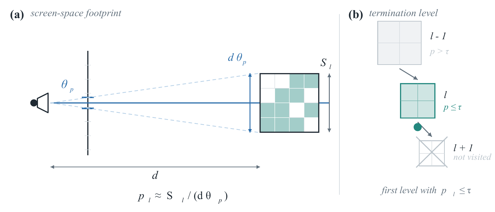

The evaluation uses <code>LOD_PIXEL_THRESHOLD = 0.6</code> for the runtime LOD configurations. Image-quality experiments additionally test thresholds 0.5, 1.0, and 1.5.

### Coverage-aware refinement

After a node passes the screen-space test, the dominant ray axis selects one of three passability bits. A well-covered node terminates immediately; a sparse node may continue for at most <code>PREFILTER_MAX_COVERAGE_DESCENT</code> levels.

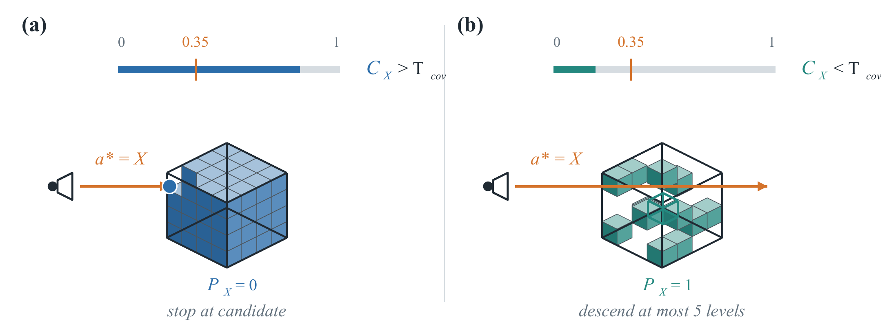

The current coverage estimate uses exposed directional area:

    C_a = (A_-a + A_+a) / (2 S^2)

with <code>PREFILTER_COVERAGE_THRESHOLD = 0.35</code> and a maximum additional descent of five levels. This is a compact approximation rather than an exact OR of projected voxel columns.

### Bottom-up prefilter

Exact exposed and boundary areas are first computed from each <code>4 x 4 x 4</code> leaf occupancy mask. Internal nodes aggregate child statistics and subtract hidden sibling interfaces. DAG-aware memoisation constructs the result once per unique node.

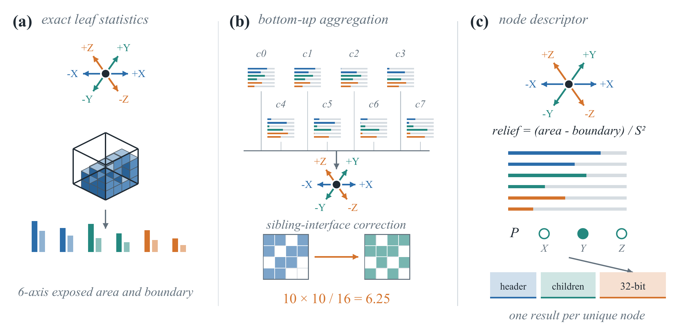

Boundary subtraction separates the box surface already resolved by the ray from unresolved internal geometry. A solid block therefore has zero internal relief and falls back to the actual first-hit box normal; slabs, steps, and porous nodes retain different node-specific distributions.

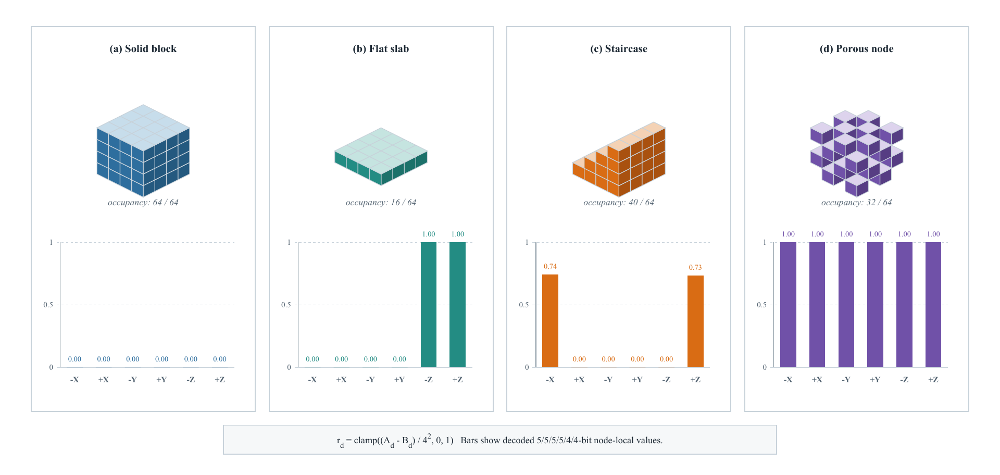

The result is stored after each interior or leaf node. Bits 0-27 contain the six relief bins using the <code>5/5/5/5/4/4</code> allocation, bits 28-30 contain the X/Y/Z passability flags, and bit 31 is reserved.

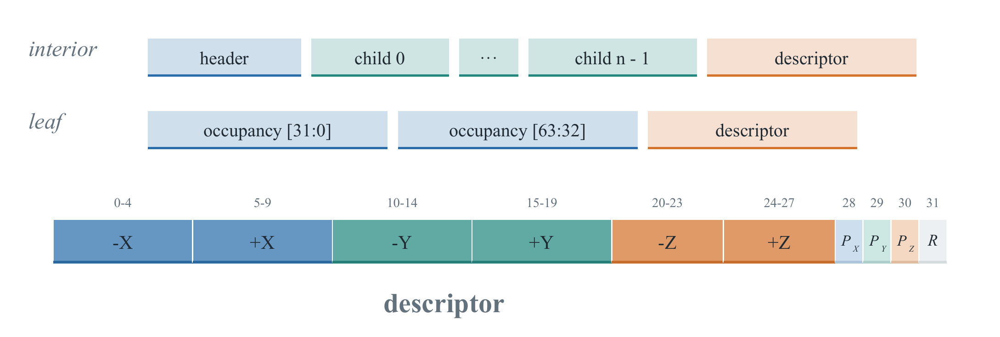

### Appearance reconstruction

At an accepted LOD node, the renderer combines representative colour, the ray-entry box normal, and the visible part of the six-direction relief distribution. Relief restores part of the directional variation removed by coarse aggregation without reconstructing the terminated subtree.

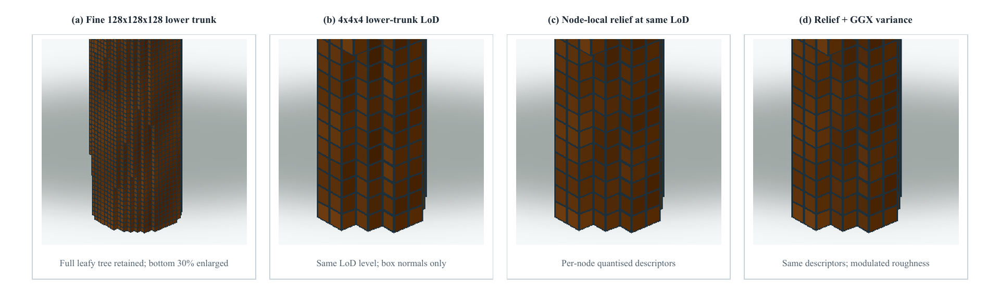

For specular shading, relief variance broadens one GGX lobe around the correct box normal instead of evaluating several competing axis-aligned highlights. The controlled response below compares fine voxels, a coarse box normal, relief weighting, and relief with variance-derived roughness.

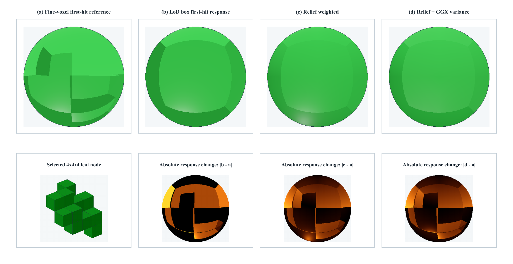

## Evaluation

Runtime measurements use a 998-frame Epic Citadel replay at depth 17 and 1280 x 960 output resolution. With shadows disabled and <code>LOD_PIXEL_THRESHOLD = 0.6</code>, the measured mean GPU frame times were:

- Original HashDAG: 11.694 ms.
- Box LOD: 9.314 ms, or 1.26x.
- Relief LOD: 9.378 ms, or 1.25x.
- Complete coverage-aware method: 10.363 ms, or 1.13x.

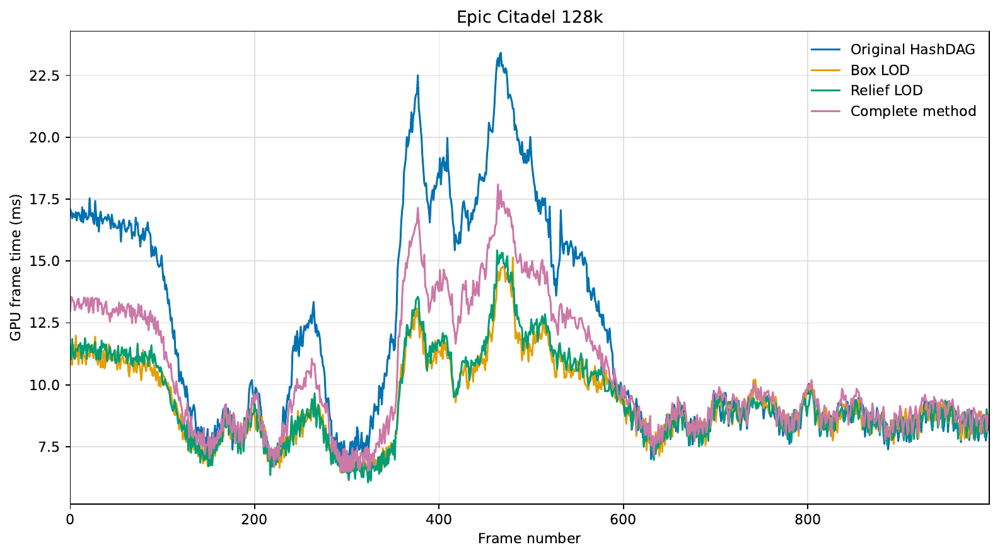

The complete method gives up part of the maximum LOD speed-up to refine sparse candidate nodes. The visual comparison shows why: box-normal and relief-only results can thicken or close partially occupied regions, whereas bounded coverage-aware descent retains more gaps and boundary detail.

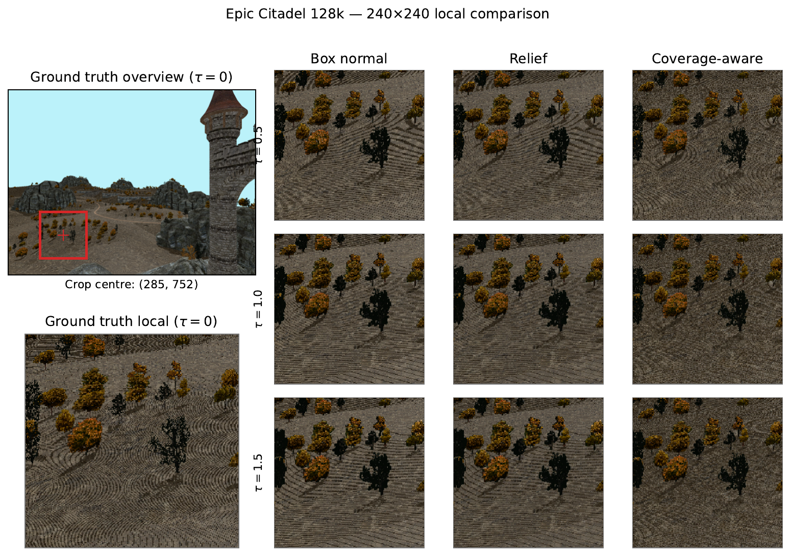

Across thresholds 0.5, 1.0, and 1.5, relief improves PSNR and LPIPS over box-normal shading, while their SSIM values remain close because both use the same coarse occupancy footprint. Coverage-aware relief produces the best PSNR, SSIM, and LPIPS result at every tested threshold.

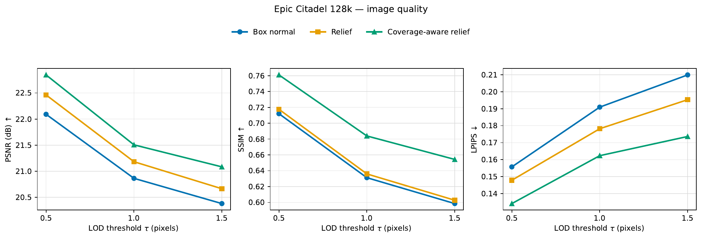

The inline descriptor increases logical geometry storage by 19.27%, but colour storage is unchanged, giving a 4.36% increase in total logical scene storage. In the recorded single construction run, total construction time increased from 43.613 s to 109.996 s.

Detailed reproduction instructions are available in:

- [Runtime evaluation](EVALUATION.md)
- [Image-quality evaluation](IMAGE_QUALITY.md)
- [Construction and memory evaluation](BUILD_EVALUATION.md)

## Configuration

Project-specific overrides are defined in [src/script_definitions.h](src/script_definitions.h). The principal LOD options are:

    #define LOD_PIXEL_THRESHOLD 0.6f
    #define LOD_COLOR_SAMPLES 1
    #define ENABLE_PREFILTERED_SHADING 1
    #define PREFILTER_ROUGHNESS_FROM_VARIANCE 1
    #define ENABLE_COVERAGE_AWARE_LOD 1
    #define PREFILTER_COVERAGE_THRESHOLD 0.35f
    #define PREFILTER_MAX_COVERAGE_DESCENT 5

Use <code>LOD_PIXEL_THRESHOLD 0.f</code> for the full-resolution reference. Only one experiment configuration should be active before each rebuild.

## Building

### Windows

Open <code>DAG_edits.sln</code> in Visual Studio, select a 64-bit Release configuration, and build with a compatible CUDA toolkit installed. The evaluation reported in this repository used MSVC v143 and CUDA 13.1.

### Linux

The project also includes a <code>CMakeLists.txt</code>. Install CUDA, GLFW3, and GLEW, then configure and build with CMake.

The original scene binaries can be downloaded from the [HashDAG data folder](https://drive.google.com/drive/folders/1sIYzKSAmOoMA9sfqzkpkF_LiN2HYKxxp?usp=sharing) and placed under <code>data/</code>. Compressed DAGs with colours can be generated from meshes with [DAG-example](https://github.com/gegoggigog/DAG-example/tree/compression) or its [extended fork](https://github.com/Phyronnaz/DAG_Compression).

## Useful controls

- <code>V</code>: save a UI-free PNG of the current render texture.
- <code>H</code>: hide the user interface.
- <code>X</code>: toggle shadows and fog.
- <code>R</code>: reset replay.
- <code>Shift+R</code>: clear replay.
- <code>Backspace</code>: save replay to disk.
- <code>M</code>: print allocated CUDA memory statistics.
- <code>P</code>: print renderer statistics.
- <code>Shift+P</code>: print DAG/SVO statistics.
- <code>Ctrl+Z</code> / <code>Ctrl+Shift+Z</code>: undo / redo.
- <code>Tab</code> / <code>Shift+Tab</code>: switch editing tools.
- <code>G</code>: run garbage collection.
- <code>U</code>: clear undo history.

## Current limitations

Coverage is estimated from exposed directional area, so several occupied segments along one projected column may be counted more than once. Internal relief is not visibility-complete and can retain surfaces inside closed cavities or behind fully occluding layers. The GGX model also lacks many material parameters normally stored by a production renderer and can exhibit distant voxel aliasing or moiré patterns. Finally, the new subtree-derived descriptors are constructed for static data and are not yet maintained consistently by the interactive edit and export paths.

## Upstream project

The original HashDAG demo and paper describe interactive carving, filling, copying, painting, undo/redo, and compressed colour attributes. This fork retains that codebase while adding the LOD and appearance-prefilter experiments described above. See <code>LICENSE.txt</code> for the repository licence.
